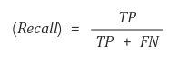

# Precision과 Recall의 이해

A라는 기술을 개발했을 때, A의 검출율이 99.99%라고 하면 과연 이 지표만 봐서 좋은 기술이라고 할 수 있을까?

문제를 바꿔서 A와 B라는 기술이 있다고 해보자

A라는 기술은 이미지에 있는 사람을 99.99%로 분류해내지만 이미지 1장당 평균 10건 정도의 오검출이 발생한다.

즉, 사람이 아닌 사물도 사람이라고 검출하는 것이 빈번하다는 것이다. 

반면에 B라는 기술은 이미지에 있는 사람들을 50%밖에 잡아내지 못하지만 사람이 아닌 것을 사람이라고 검출하지는 않는다.

이러한 경우에 기술 A와 B 중 어느 모델이 더 뛰어난 기술인가?하는 것이다.

응용에 따라 관점에 따라 달라질 수 있지만 여기서 가장 중요한 것은 검출율 만으로 기술을 평가내릴 수 없다는 것이다.

### 1. 모델의 분류와 정답

모델을 평가하는 요소는 결국, 모델이 내놓은 답과 실제 정답의 관계로써 정의내릴 수 있다. 정답이 True와 False로 나누어져 있고, 분류 모델 또한 True, False의 답을 내놓는다고 하면 아래와 같이 2x2 matrix로 case를 나눌 수 있다.

- True Positive(TP): 실제 True인 답을 True라고 예측(정답)
- False Positive(FP): 실제 False인 답을 True라고 예측(오답)
- Fasle Negative(FN): 실제 True인 답을 False라고 예측(오답)
- True Negative(TN): 실제 False인 답을 False라고 예측(정답)

### 2. Precision, Recall, Accuracy

Precision, Recall, Accuracy는 가장 많이 사용하는 지표들이다.

**2-1 Precision(정밀도)**

Precision이란 모델이 True라고 분류한 것 중에서 실제 True인 것의 비율이다. 즉 아래와 같은 식으로 표현이 가능하다.

Posivie 정답률, PPV(Positive Predictive Value)라고도 불린다. 날씨가 맑다고 예측했는데 실제 날씨가 맑았는지 확인하는 지표다.

**2-2 Recall(재현율)**

재현율이란 실제 True인 것중에서 모델이 True라고 예측한 것의 비율이다.

통계학에서는 sensitivity라고도 하고, 다른 분야에서는 hit rate라고도 한다. 실제 맑은 날 중에서 모델이 맑다고 예측한 비율의 지표다.

**종합**

즉, Precision이나 Recall은 모두 실제 True인 답을 모델이 True라고 예측한 경우에 관심이 있으나, 바라보고자 하는 관점이 다른 것이다.

Precision은 모델의 입장에서, 그리고 Recall은 실제 정답의 입장에서 정답을 정답이라고 맞춘 경우를 바라보고 있다.

만약 *어떤 요소에 의해, 확실히 맑은 날을 예측할 수 있다면 해당하는 날에만 맑은 날이라고 예측하는 모델*이 있다면 확실하지 않은 날에는 아예 예측을 하지 않고

보류하여 FP의 경우의 수를 줄여, Precision을 극도로 끌어올리는 일종의 편법일 것이다.

한 달동안 맑은 날이 20일이었지만 확실한 2일만 맑다고 예측한다면 당연히 Precision(맑다고 예측한 날 중 실제 맑은 날)은 100%가 될 것이다. 

하지만 이러한 모델이 정상적인 모델은 아닐 것이다.

따라서, 실제로 맑은 20일 중에서 예측한 맑은 날의 수도 고려해 봐야 한다. 이 경우에는 Precision만큼 높은 결과가 나오지 않다.

Precision과 함께 Recall을 함께 고려하면 실제 맑은 날의 입장에서 우리의 모델이 맑다고 예측한 비율을 함게 고려하게 되어 제대로된 평가를 내릴 수 있다.

Precision과 Recall은 상호보완적으로 사용할 수 있으며, 두 지표가 모두 높을수록 좋은 모델이라고 평가내릴 수 있다.

### 3. Precision-recall 그래프

다음은 알고리즘의 파라미터 조절 등에 따른 Precision과 Recall 값의 변화 그래프다. 

Precision-recall 그래프는 다양한 형태로 변형되어 표현될 수 있는데 recall 대신에 miss rate(=1-recall), precision 대신에 false alarm rate(=1-precision) 등이 사용될 수 있다.

**3-1 Average Precision(AP) **

precision-recall 그래프는 어떤 알고리즘의 성능을 전반적으로 파악하기 좋으나 정량적으로 비교하기에 불편한 점이 있다.

그래서 나온 개념이 average precision(AP)이다. AP는 인식 알고리즘의 성능을 하나의 값으로 표현한 것으로서 precision-recall 그래프에서 그래프 선 아래쪽의 면적으로 계산된다. 위 그림 1의 예에서 괄호 안의 숫자가 해당 알고리즘의 AP 값이다. 그리고 Ap가 높으면 높을수록 그 알고리즘의 성능이 전체적으로 우수하다는 의미다. 컴퓨터 비전 분야에서 물체인식 알고리즘의 성능은 대부분 AP로 평가한다. 

### 4. F-measure

알고리즘의 precision-recall 성능을 하나의 숫자로 표현한 또 다른 방법이다. 

F-measure는 precision과 recall의 조화평균으로 계산된다.

